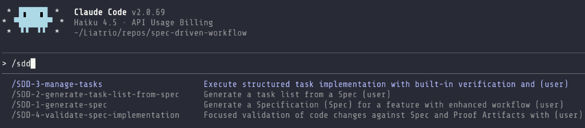
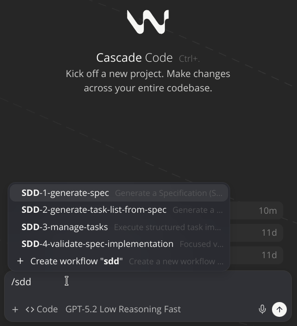

<div align="center">
    
    <h1>🧭 Spec-Driven Development Workflow</h1>
    <h3><em>Build predictable software with a repeatable AI-guided workflow.</em></h3>
</div>

<p align="center">
    <strong>Spec-driven development prompts for collaborating with AI agents to deliver reliable outcomes.</strong>
</p>

<p align="center">
    <a href="https://github.com/liatrio-labs/spec-driven-workflow/actions/workflows/ci.yml"></a>
    <a href="https://github.com/liatrio-labs/spec-driven-workflow/blob/main/LICENSE"></a>
    <a href="https://github.com/liatrio-labs/spec-driven-workflow/stargazers"></a>
</p>

## Overview

This repository provides **structured prompts** (Markdown files) that guide AI assistants through a complete software development workflow:

- **Define intent**: generate a reviewed spec with clear demo criteria
- **Plan**: break work into demoable tasks and subtasks
- **Execute**: implement with checkpoints and proof artifacts
- **Validate**: verify implementation against the spec with evidence

Think of these prompts as reusable playbooks that keep AI agents focused and consistent across long conversations.

## Table of Contents

- [TLDR / Quickstart](#tldr--quickstart)
- [Details for the 4-step workflow](#details-for-the-4-step-workflow)
- [Artifacts and directory layout](#artifacts-and-directory-layout)
- [Documentation](#documentation)
- [Context verification markers](#context-verification-markers)
- [Security best practices](#security-best-practices)
- [Contributing](#contributing)
- [References](#references)
- [License](#license)

## TLDR / Quickstart

### Installation options

#### Option A: Install as Slash Commands (Recommended)

Install these prompts as native `/slash-commands` in your AI assistant (Cursor, Windsurf, Claude Code, etc.) using the [slash-command-manager](https://github.com/liatrio-labs/slash-command-manager) utility:

**Prerequisite:** `uvx` comes from [uv](https://docs.astral.sh/uv/). Install uv first if you don’t already have it:

- (Mac): `brew install uv`
- (Windows): `winget install astral-sh.uv`

##### Install SDD w/ Bash (Mac)

```bash
uvx --from git+https://github.com/liatrio-labs/slash-command-manager \
  slash-man generate \
  --github-repo liatrio-labs/spec-driven-workflow \
  --github-branch main \
  --github-path prompts/
```

##### Install SDD w/ PowerShell (Windows)

```ps
uvx --from git+https://github.com/liatrio-labs/slash-command-manager `
  slash-man generate `
  --github-repo liatrio-labs/spec-driven-workflow `
  --github-branch main `
  --github-path prompts/
```

**What this command does:**

- `uvx` runs a Python tool without installing it globally (like `npx` for Python)
- Fetches the `slash-command-manager` tool from GitHub
- Auto-detects your installed AI assistants from the list of supported tools
- Downloads the prompt files for each supported tool from the `prompts/` directory
- Installs them as slash commands for each supported tool

**Result:** you can now type `/SDD-1-generate-spec` in your AI assistant to start the workflow.

**Where to use the slash commands:** in AI chat UIs (e.g., Windsurf, Claude Code) type `/` in the chat input. Some AI assistants require being in "Agent" or "Code" mode for slash commands to appear.





#### Option B: Manual Copy-Paste (No Installation)

Copy the contents of a prompt file directly from `prompts/` and paste it into your AI chat. The AI will follow the structured instructions in the prompt.

### Quick "try it" flow

1. Run `/SDD-1-generate-spec` and describe the feature you want.
2. Next, use `/SDD-2-generate-task-list-from-spec` pointing it at the generated spec.
3. Then execute `/SDD-3-manage-tasks` to implement tasks one at a time (creating proof artifacts before commits).
4. Finally, apply `/SDD-4-validate-spec-implementation` to verify the implementation against the spec.

## Details for the 4-step workflow

Each step uses a different prompt file and produces specific artifacts in `docs/specs/`.

1. **Generate a spec** ([`prompts/SDD-1-generate-spec.md`](./prompts/SDD-1-generate-spec.md))
   - **What it does**: asks structured clarifying questions, checks scope, and writes a junior-friendly spec with demo criteria
   - **Output**: `docs/specs/[NN]-spec-[feature-name]/[NN]-spec-[feature-name].md`
   - **Why**: aligns humans + AI on what to build before any code changes

2. **Generate a task list** ([`prompts/SDD-2-generate-task-list-from-spec.md`](./prompts/SDD-2-generate-task-list-from-spec.md))
   - **What it does**: converts the spec into parent tasks (demoable units) + detailed subtasks with a "Relevant Files" section
   - **Output**: `docs/specs/[NN]-spec-[feature-name]/[NN]-tasks-[feature-name].md`
   - **Why**: creates an actionable plan with clear checkpoints and reviewable scope

3. **Manage tasks (implementation loop)** ([`prompts/SDD-3-manage-tasks.md`](./prompts/SDD-3-manage-tasks.md))
   - **What it does**: guides execution with checkpoints, verification checklists, and proof artifacts created **before** each commit
   - **Output**: `docs/specs/[NN]-spec-[feature-name]/[NN]-proofs/[NN]-task-[TT]-proofs.md`
   - **Why**: keeps work single-threaded, demoable, and evidence-driven

4. **Validate implementation** ([`prompts/SDD-4-validate-spec-implementation.md`](./prompts/SDD-4-validate-spec-implementation.md))
   - **What it does**: validates implementation vs spec using proof artifacts, applies validation gates, produces a coverage matrix
   - **Output**: validation report (markdown) showing verified/missing items
   - **Why**: confirms completeness before shipping

5. **SHIP IT** 🚢💨

## Highlights

- **Prompt-first workflow:** Use curated prompts to go from idea → spec → task list → implementation-ready backlog.
- **Predictable delivery:** Every step emphasizes demoable slices, proof artifacts, and collaboration with junior developers in mind.
- **No dependencies required:** The prompts are plain Markdown files that work with any AI assistant.
- **Context verification:** Built-in emoji markers (SDD1️⃣-SDD4️⃣) detect when AI responses follow critical instructions, helping identify context rot issues early.

## Why Spec-Driven Development?

Spec-Driven Development (SDD) keeps AI collaborators and human developers aligned around a shared source of truth. This repository provides a lightweight, prompt-centric workflow that turns an idea into a reviewed specification, an actionable plan, and a disciplined execution loop. By centering on markdown artifacts instead of tooling, the workflow travels with you—across projects, models, and collaboration environments.

## Guiding Principles

- **Clarify intent before delivery:** The spec prompt enforces clarifying questions so requirements are explicit and junior-friendly.
- **Ship demoable slices:** Every stage pushes toward thin, end-to-end increments with clear demo criteria and proof artifacts.
- **Make work transparent:** Tasks live in versioned markdown files so stakeholders can review, comment, and adjust scope anytime.
- **Progress one slice at a time:** The management prompt enforces single-threaded execution to reduce churn and unfinished work-in-progress.
- **Stay automation ready:** While SDD works with plain Markdown, the prompts are structured for MCP, IDE agents, or other AI integrations.

## Artifacts and directory layout

Each prompt writes Markdown outputs into `docs/specs/[NN]-spec-[feature-name]/` (where `[NN]` is a zero-padded 2-digit number: 01, 02, 03, etc.), giving you a lightweight backlog that is easy to review, share, and implement.

- **Specs:** `docs/specs/[NN]-spec-[feature-name]/[NN]-spec-[feature-name].md`
- **Task lists:** `docs/specs/[NN]-spec-[feature-name]/[NN]-tasks-[feature-name].md`
- **Proof artifacts:** `docs/specs/[NN]-spec-[feature-name]/[NN]-proofs/[NN]-task-[TT]-proofs.md`
- **Validation reports:** `docs/specs/[NN]-spec-[feature-name]/[NN]-validation-[feature-name].md`

Example directory structure:

```bash
docs/specs
└── 01-spec-feature-name
    ├── 01-proofs
    │   ├── 01-task-01-proofs.md
    │   ├── 01-task-02-proofs.md
    │   ├── 01-task-03-proofs.md
    │   └── 01-task-04-proofs.md
    ├── 01-questions-1-feature-name.md
    ├── 01-spec-feature-name.md
    ├── 01-tasks-feature-name.md
    └── 01-validation-feature-name.md
```

## Documentation

For comprehensive documentation, examples, and detailed guides, visit the **SDD Playbook**:

- **[SDD Playbook](https://liatrio-labs.github.io/spec-driven-workflow/)** — Complete overview and workflow guide
- **[Comparison](https://liatrio-labs.github.io/spec-driven-workflow/comparison.html)** — How SDD compares to other structured development tools
- **[Developer Experience](https://liatrio-labs.github.io/spec-driven-workflow/developer-experience.html)** — Real-world usage examples and patterns
- **[Common Questions](https://liatrio-labs.github.io/spec-driven-workflow/common-questions.html)** — FAQ and troubleshooting
- **[Video Overview](https://liatrio-labs.github.io/spec-driven-workflow/video-overview.html)** — Visual walkthrough of the workflow
- **[Reference Materials](https://liatrio-labs.github.io/spec-driven-workflow/reference-materials.html)** — Additional resources and examples

### Getting help

- **Start here**: [Common Questions](https://liatrio-labs.github.io/spec-driven-workflow/common-questions.html)
- **Ask/Report**: open a GitHub Issue in this repo with details about your environment + prompt/tooling

## Context verification markers

Each prompt includes a context verification marker (SDD1️⃣ for spec generation, SDD2️⃣ for task breakdown, SDD3️⃣ for task management, SDD4️⃣ for validation) that appears at the start of AI responses. These markers help detect **context rot**—a phenomenon where AI performance degrades as input context length increases, even when tasks remain simple.

**Why this matters:** Context rot doesn't announce itself with errors. It creeps in silently, causing models to lose track of critical instructions. When you see the marker at the start of each response, it's an <strong>indicator</strong> that the AI is probably following the prompt's instructions. If the marker disappears, it's an immediate signal that context instructions may have been lost.

**What to expect:** You'll see responses like `SDD1️⃣ I'll help you generate a specification...` or `SDD3️⃣ Let me start implementing task 1.0...`. This is normal and indicates the verification system is working. For more details, see the [research documentation](docs/emoji-context-verification-research.md).

## Security Best Practices

### Protecting Sensitive Data in Proof Artifacts

Proof artifacts are committed to your repository and may be publicly visible. **Never commit real credentials or sensitive data.** Follow these guidelines:

- **Replace credentials with placeholders**: Use `[YOUR_API_KEY_HERE]`, `[REDACTED]`, or `example-key-123` instead of real API keys, tokens, or passwords
- **Use example values**: When demonstrating configuration, use dummy or example data instead of production values
- **Sanitize command output**: Review CLI output and logs for accidentally captured credentials before committing
- **Consider pre-commit hooks**: Tools like [gitleaks](https://github.com/gitleaks/gitleaks), [truffleHog](https://github.com/trufflesecurity/truffleHog), or [talisman](https://github.com/thoughtworks/talisman) can automatically scan for secrets before commits

The SDD workflow prompts include built-in reminders about security, but ultimate responsibility lies with the developer to review artifacts before committing or pushing to remotes.

## Contributing

See [`CONTRIBUTING.md`](CONTRIBUTING.md). Please review [`CODE_OF_CONDUCT.md`](CODE_OF_CONDUCT.md).

## References

| Reference | Description | Link |
| --- | --- | --- |
| AI Dev Tasks | Foundational example of an SDD workflow expressed entirely in Markdown. | [snarktank/ai-dev-tasks](https://github.com/snarktank/ai-dev-tasks) |
| Slash Command Manager | Utility for installing prompts as slash commands in AI assistants. | [liatrio-labs/slash-command-manager](https://github.com/liatrio-labs/slash-command-manager) |
| MCP | Standard protocol for AI agent interoperability. | [modelcontextprotocol.io](https://modelcontextprotocol.io/docs/getting-started/intro) |

## License

This project is licensed under the Apache License, Version 2.0. See the [LICENSE](LICENSE) file for details.
